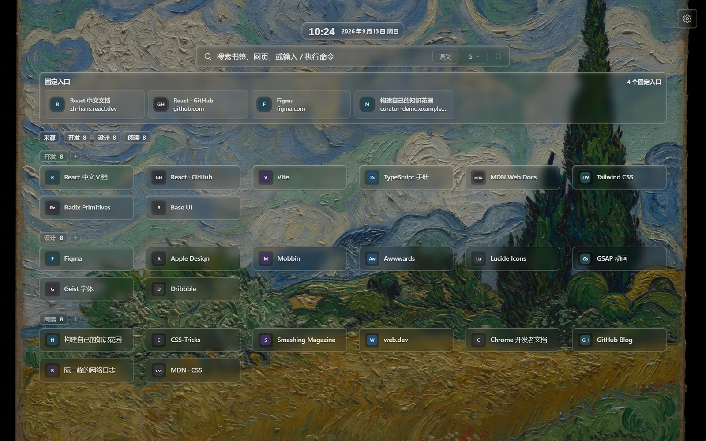

<p align="center">
  
</p>

<h1 align="center">Curator — 找回、整理和使用你的书签</h1>

<p align="center">
  本地优先的 Chrome 书签工作区：快速收藏与搜索、常驻侧栏、液态玻璃新标签页、清理恢复与离线存档。<br>
  无需账号或 AI 服务即可使用核心功能。当前为 Beta / 本地安装阶段，尚未在 Chrome Web Store 上架。
</p>

<p align="center">
  
  
  
  
</p>

https://github.com/user-attachments/assets/54babc20-983f-42e3-bfc9-89510a9194aa

60 秒完整介绍 · 1080p / 30fps · 画面来自当前版本，使用演示书签与示例数据。

## 功能一览

Curator 直接使用原生 Chrome 书签。弹窗、侧栏和新标签页共享同一份书签数据，收藏、改名、移动和删除会随浏览器书签事件更新。

| 想做什么 | Curator 提供什么 |
| --- | --- |
| 先收藏，之后再整理 | 当前页快速保存、手动选择文件夹、Inbox / 待整理快捷键 |
| 找回已经收藏的内容 | 关键词、拼音、原文短语、域名、文件夹和时间组合检索；支持已保存的标签与内容索引 |
| 阅读时随手查资料 | 常驻侧栏、当前网页卡片、书签编辑与移动、统一键盘操作 |
| 打开浏览器就进入工作状态 | 液态玻璃新标签页、多个书签来源、Speed Dial、网页搜索、时钟与自选背景 |
| 清理积累的书签 | 可用性检测、重定向更新、重复检测、文件夹清理建议、回收站与可预览的恢复点 |
| 留住内容或迁移数据 | 页面 MHTML 离线存档、完整 JSON 备份、通用 HTML 书签导出 |

### 收藏与搜索

在弹窗或侧栏中保存当前网页，也可以按 **Alt + Shift + I** 直接放入 **Inbox / 待整理**，集中处理尚未归类的收藏。文件夹浏览、搜索结果和当前页操作放在同一处，支持编辑标题与网址、移动文件夹、删除和键盘打开。

搜索会匹配标题、网址、文件夹路径与拼音；已有标签、摘要和网页内容索引也可以帮助找回资料。域名、路径、时间与排除条件可以组合，示例见下方“搜索示例”。本地搜索无需配置 AI。

### 常驻书签侧栏

在弹窗顶部点击 **打开常驻书签侧栏**，即可边阅读网页边搜索和整理。侧栏会跟随当前网页更新保存状态；打开书签、切换网页或进入设置后，搜索内容仍会保留。窄侧栏使用纵向布局与紧凑操作菜单，弹窗和侧栏共享快捷键帮助。

### 按习惯定制新标签页

- **书签来源与浏览**：选择多个文件夹，使用展开视图或文件夹导航；可以显示来源导航、隐藏文件夹标题，并拖拽调整书签和文件夹顺序。
- **Speed Dial（固定入口）**：固定常用书签，作为独立的快捷入口；按需显示或关闭该模块。
- **液态玻璃**：统一调整书签卡片、时钟、搜索栏和设置面板的模糊、底色、折射、边缘高光与光照，实时预览效果。
- **卡片与图标**：紧凑、均衡和展示预设；可调页面宽度、卡片宽度、列数、间距、图标大小和标题行数，也可上传自定义图标。
- **背景与滤镜**：纯色、本地图片、本地视频、图片链接与精选图库；可收藏精选背景、调整画面位置，并使用遮罩、磨砂、颗粒、半调、ASCII 等效果。
- **搜索与时钟**：本地书签搜索、快捷命令与可选网页搜索；支持 Google、Bing、百度、DuckDuckGo 等引擎，以及多引擎搜索。时间和日期可调整布局、字号、格式与时区。

设置修改后实时生效并保存。新标签页内的搜索引擎设置只影响 Curator 搜索栏，不改变 Chrome 默认搜索引擎。

<p align="center">
  
</p>

## 快速开始

1. 使用 Chrome 116 或更新版本，从 [Releases](https://github.com/sy0u1ti/curator-bookmarks/releases) 下载并解压最新 `curator-bookmarks-*.zip`，或按下方说明从源码构建。
2. 打开 `chrome://extensions/`，启用 **开发者模式**，点击 **加载已解压的扩展程序**，选择包含 `manifest.json` 的 `dist` 文件夹。
3. 点击扩展图标或按 **Alt + Shift + S** 搜索已有书签。无需配置 AI。
4. 打开新标签页，在 **设置 → 书签来源** 选择要展示的文件夹；也可以新建一个专用来源文件夹。
5. 在任意网页按 **Alt + Shift + I**，即可收藏到 **Inbox / 待整理**。

Curator 会替换 Chrome 新标签页。若需恢复浏览器默认新标签页，可在扩展管理页停用或移除 Curator；原生 Chrome 书签会保留。

### 搜索示例

| 输入 | 含义 |
| --- | --- |
| `react`、`shuqian` | 本地关键词、拼音搜索 |
| `"not found"`、`"我爱我家"` | 按引号内的原文查找，不将其中的词解释成指令 |
| `site:github.com react` | 在该域名及子域名内搜索 React，不匹配网址参数中的域名文字 |
| `url:/issues` | 查找网址中包含 `/issues` 的书签 |
| `folder:"前端资料"` | 限定文件夹路径 |
| `type:文档` | 按已保存的内容类型筛选；需要先生成相应元数据 |
| `最近2周`、`昨天`、`上个月` | 按书签添加时间筛选 |
| `-youtube`、`-"短视频"` | 排除结果 |

这些条件可以组合使用。自然语言模式在配置 AI 后可改写查询；未配置或请求失败时回退到本地解析。

### 快捷键

| 默认快捷键 | 操作 |
| --- | --- |
| Alt + Shift + S | 打开弹窗并聚焦搜索 |
| Alt + Shift + I | 收藏当前页面到 Inbox / 待整理 |
| Alt + Shift + F | 打开弹窗并开始智能分类，需要先配置 AI |

快捷键可能与系统或其他扩展冲突，可在 `chrome://extensions/shortcuts` 中修改；自动分析开关也可以在此分配快捷键。

弹窗与侧栏内使用相同的键盘操作；顶部键盘图标可以随时查看帮助。

| 界面内快捷键 | 操作 |
| --- | --- |
| Ctrl / ⌘ + K | 聚焦搜索并保留查询 |
| `/`（输入框外） | 聚焦搜索 |
| ↑ / ↓ | 选择结果；搜索时焦点留在输入框 |
| Enter | 在新标签页打开选中书签 |
| Ctrl / ⌘ + Enter | 在后台打开，保留当前界面 |
| Alt + Enter | 在当前网页标签页打开 |
| F2 | 编辑选中的书签 |
| Esc | 关闭帮助或对话框、返回、清空搜索 |
| Ctrl / ⌘ + `/`，或 `?`（输入框外） | 查看键盘帮助 |

侧栏不会自动获得所有站点的访问权。切换到未授权网页时，可以点击浏览器工具栏中的 Curator 图标启用该页的快速保存与分类；侧栏书签搜索和整理一直可用。

## 整理、备份与迁移

### 清理前先看结果

- **可用性检测**区分可访问、已重定向、待复查和访问失败；可以查看检测历史、筛选结果，并为书签、域名或文件夹设置忽略规则。
- **重定向更新**展示原网址与最终网址，确认后更新所选书签。
- **文件夹清理**识别空文件夹、过深的单书签路径、单一路径链、同名文件夹与大型文件夹，给出删除、上移、合并或拆分建议。
- 重复检测保留 URL 的协议、端口、路径大小写、参数和片段，不把不同资源直接当作可删除的副本。重定向请使用独立的重定向检测流程。
- 回收前可以检查保留策略和选中项；每组重复书签至少保留一条。通过 Curator 回收的书签可以在回收站中查看和恢复。

### 恢复前先看原内容

- **自动恢复点**在批量整理或恢复前创建，默认保留最近 5 个。在“设置 → 数据与备份”选择恢复点，可以搜索备份中的标题、网址和原文件夹路径，并筛出当前缺失的书签。
- **完整备份（JSON）**保存书签、标签、规则和设置，不导出 AI API Key。恢复点与导入文件使用相同的预览和确认流程；可选择“恢复书签与标签”“只恢复标签数据”“只恢复新标签页设置”或“安全恢复全部”。
- **通用书签（HTML）**保存书签、文件夹和添加时间，适合通过 Chrome、Edge、Firefox 的书签管理器导入。Curator 标签和设置使用完整备份迁移。
- 完整恢复会把缺失书签复制到新的恢复文件夹，并将标签关联到恢复后的书签；已有的较新标签和手动标签优先保留。
- “恢复书签与标签”保留当前设置、回收站和清理规则。书签恢复按网址与原路径补齐缺失项；不会将现有文件夹整体回退或删除当前书签。后台保留恢复日志，失败或中断时处理本次写入。

## 页面离线存档

在需要保存的网页上打开弹窗或侧栏，点击“存档当前页面”，在独立存档页点击“保存离线文件”。首次保存时按需请求页面存档权限，生成可用 Chrome 或 Edge 打开的单文件 **MHTML**。

存档包含当前已加载的正文、图片和样式。保存前请展开需要保留的内容，并保持来源页打开；未加载内容、流媒体、脚本交互和服务器功能无法完整离线使用。存档使用 Chromium 原生页面捕获，保存在下载文件中，不经过 AI 或 Curator 服务。通用 HTML 书签导出仍用于迁移链接清单。

## 可选 AI

配置自己的服务后，可以在当前页或所选书签范围内使用智能分析：生成标签、摘要、别名、重命名建议与文件夹推荐，辅助分类和检索。支持 OpenAI 兼容的 **Responses API** 与 **Chat Completions API**，也可使用兼容的本地服务。

自动分析、自动移动与远程内容解析均可单独控制，也可以选择只打标签、不自动移动。手动整理默认优先，批量重命名或移动提供预览和确认，并可查看 AI 整理记录。网页内容索引单独控制，用于检索已经保存的内容；需要完整页面副本时使用 MHTML 存档。

关闭 AI 后，本地检索、书签管理、新标签页、清理、备份和离线存档继续可用。

## 本地数据与外部请求

书签保存在 Chrome；标签、内容索引、使用记录和设置保存在当前浏览器的扩展存储中。Curator 不使用默认远程行为遥测。

| 用户操作 | 可能访问的服务 |
| --- | --- |
| 运行链接检测或授权内容提取 | 对应书签站点；按 origin 请求可选主机权限 |
| 启用 AI 或 Jina Reader | 用户配置的 AI 服务或 Jina；按 origin 请求授权 |
| 提交网页搜索 | 所选搜索引擎；Curator 不代理或记录该查询 |
| 主动选择远程背景 | 所选图片、视频或精选图库来源 |

默认背景为本地纯色。Manifest 另声明了 NASA、Met、Wikimedia 和 Cleveland Art 四个精选图片来源的固定主机权限，用于用户选中的远程图片；`http://*/*` 和 `https://*/*` 为可选主机权限。仅声明权限不会自动上传书签。

## 从源码构建

推荐 **Node.js 24**；当前 Vite 8 要求 Node.js 20.19+（20.x）或 22.12+。

```bash
npm ci
npm run build
```

构建产物位于 `dist/`，按快速开始中的步骤加载。开发预览使用 `npm run dev`；Chrome API 和权限行为需要在实际加载扩展的 Chromium 中验证。

更新源码并重新构建后，还需在 `chrome://extensions` 找到 Curator 并点击“重新加载”，让新增权限与入口生效。只重新打开弹窗不会更新浏览器已加载的扩展配置；侧栏入口遇到旧配置时会给出提示，并提供“打开扩展管理”按钮。

## 开发验证

```bash
npm run typecheck       # TypeScript
npm test                # 逻辑、数据完整性、搜索与静态回归
npm run smoke:extension # 构建并运行完整扩展浏览器回归
npm run test:workspace-browser # 已构建后的恢复点、原生侧栏、键盘与 MHTML 回归
```

浏览器测试使用独立临时 profile 和合成书签；首次运行若缺少浏览器，执行 `npx playwright install chromium`。多数单项浏览器测试读取 `dist/`，需要先构建。

页面存档测试只在临时扩展副本中预授予捕获权限和本地测试站点权限，以绕过无界面浏览器的原生授权提示；实际 MHTML 生成、下载与断网打开使用浏览器原生能力。生产构建中的 `pageCapture` 仍为可选权限。

需要不弹出浏览器窗口的自动验证时，设置 `CURATOR_HEADLESS=1` 后运行烟测；PowerShell 示例：`$env:CURATOR_HEADLESS='1'; npm run smoke:extension`。

建议在 Linux 和 Windows 上执行安装、类型检查、逻辑测试和构建。界面、权限和生命周期变化仍需运行扩展浏览器回归。

## 反馈与许可

问题和建议请提交到 [Issues](https://github.com/sy0u1ti/curator-bookmarks/issues)，附复现步骤、Chrome 版本及错误信息；无需附上真实书签库或密钥。

[MIT](LICENSE)
